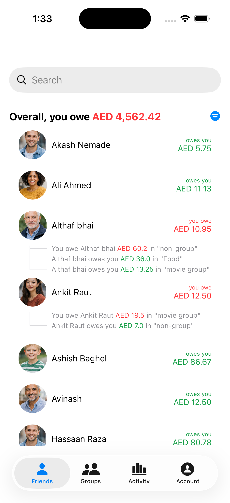
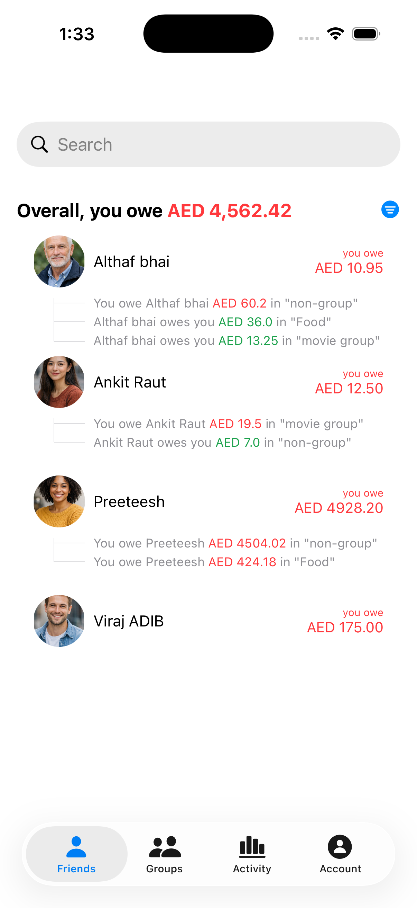
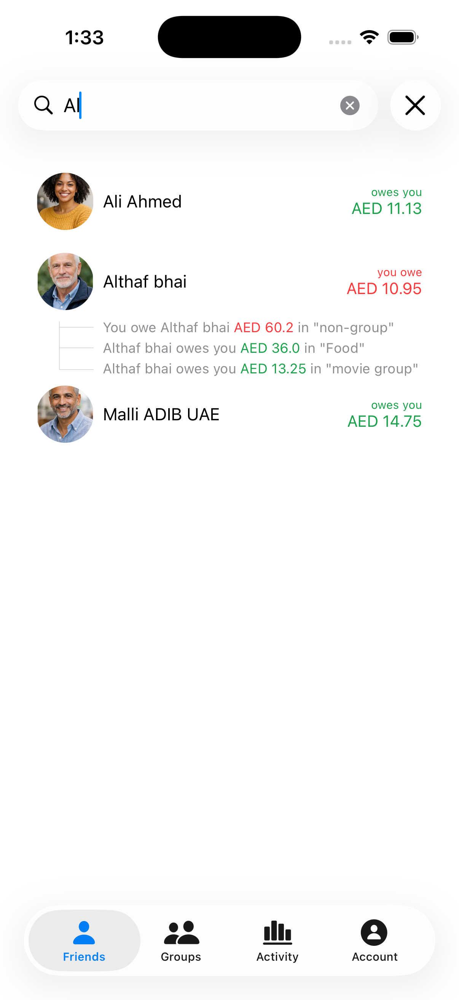

# 💸 Splitwise Clone  
### Building a Scalable Expense Sharing App in SwiftUI

> 🚀 Not just a clone.  
> A production-thinking, architecture-driven iOS project.

This project is my deep dive into building a real-world scalable expense sharing app inspired by Splitwise — engineered with modern iOS standards, clean architecture, and long-term maintainability in mind.

---

## 🎯 Vision

To build an **offline-first, scalable, modular expense management system** using:

- Modern SwiftUI  
- Clean Architecture  
- SOLID principles  
- Swift Concurrency  
- Real-world engineering patterns  

This is not a UI demo.  
This is an architecture playground.

---

## ✅ Current Build

### 🏠 Home Dashboard

- Expense listing  
- Search functionality  
- Smart filtering logic  
- State-driven SwiftUI updates  
- Clean, modular UI components  

---

## 📸 App Preview

### 🏠 Home Dashboard

  

---

### 🔍 Search & Filter

  
    

---

## 🎥 Demo

https://github.com/user-attachments/assets/be014bcf-bfc5-4dcf-a770-dad5f619a467

---

## 🛠 What’s Coming Next

- 📄 Detailed Expense Screen  
- 👥 Group Creation & Management  
- ⚙️ Settings Module  
- 🗄 Offline-First Database Layer  
- 🌐 Mock API Integration  
- ⚡ Swift Concurrency (async/await, Actors, Task)  
- 🧠 Repository Pattern + Dependency Injection  
- 🧪 Unit Testing & Scalability Improvements  

---

## 🏗 Engineering Philosophy

This project follows:

- Feature-based modular structure  
- MVVM + Repository pattern  
- Protocol-driven design  
- Dependency Injection  
- SOLID Principles  
- Scalable folder architecture  
- Offline-first thinking  

Future-ready. Interview-ready. Production-ready.

---

## 🚀 Tech Stack

- Swift  
- SwiftUI  
- Swift Concurrency (Planned)  
- CoreData / SwiftData (Planned)  
- Clean Architecture  
- MVVM  
- Repository Pattern  

---

## 💡 Why This Project?

Because real engineering is not about screens.  
It’s about:

- Scalability  
- Code clarity  
- Separation of concerns  
- Maintainability  
- Performance  
- Thoughtful architecture  

This project is where I experiment, break things, refactor, and level up.

---

## 📈 Roadmap

- [x] Home Dashboard  
- [x] Search & Filter  
- [ ] Expense Details  
- [ ] Groups  
- [ ] Offline DB  
- [ ] Mock APIs  
- [ ] Swift Concurrency  
- [ ] Testing  
- [ ] Dark Mode  
- [ ] CI/CD  

---

## 🤝 Feedback Welcome

If you’re an iOS engineer who enjoys discussing architecture, scalability, or clean code — feel free to open an issue or share feedback.

Let’s build better iOS systems 🚀
